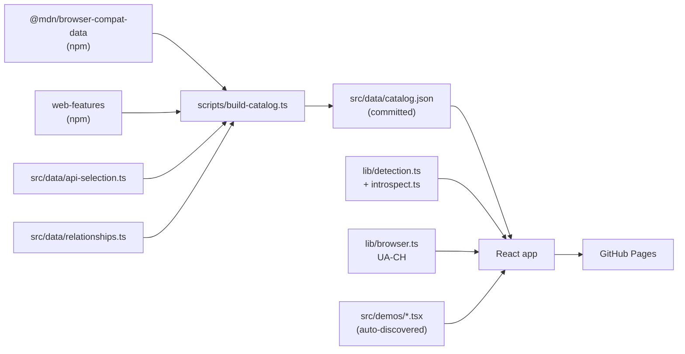

# Browser API Atlas

> An interactive, graph-based explorer for the modern web platform.

**[hmelenok.github.io/browser-api-atlas](https://hmelenok.github.io/browser-api-atlas/)** &middot; click a node &rarr; run the API in your browser &rarr; learn from the snippet.


[](https://github.com/hmelenok/browser-api-atlas/actions/workflows/ci.yml)
[](https://github.com/hmelenok/browser-api-atlas/actions/workflows/deploy.yml)
[](./LICENSE)

---

## What it is

The Atlas catalogues every major browser API as a node in a graph, then layers four signals on top:

1. **Your browser, right now** &mdash; runtime support detection (color-coded dots)
2. **Baseline status** &mdash; from the official [web-features](https://github.com/web-platform-dx/web-features) catalog
3. **Standards status** &mdash; from [@mdn/browser-compat-data](https://github.com/mdn/browser-compat-data) (experimental, deprecated, etc.)
4. **Hands-on demos** &mdash; tiny interactive playgrounds per API

It also **introspects your browser** for globals not in our catalog &mdash; the "&#x2728; new APIs detected" banner surfaces APIs that shipped recently. One click opens a pre-filled GitHub issue to add them.

## Why

There are great references for browser APIs (MDN, caniuse, web.dev). They're great at explaining one API in depth. The Atlas is different: it's a **map**, not a reference. It answers:

- _What APIs even exist?_
- _Which ones can I use today, in this browser, on this device?_
- _How does X relate to Y?_
- _Can you just show me the API in action?_

## Features

- &#x1f5fa; **Graph view** powered by [React Flow](https://reactflow.dev/) + [ELK](https://www.eclipse.org/elk/) layout, with category clustering
- &#x1f50d; **Self-discovery** &mdash; walks `window` / `navigator` / `document` looking for globals not in the catalog
- &#x1f9ed; **Browser-aware** &mdash; uses UA Client Hints (falls back to user agent) to identify what you're running on
- &#x1f4da; **Always current** &mdash; weekly GitHub Action pulls the latest BCD + web-features and opens a PR
- &#x270b; **Contribution-friendly** &mdash; one file per demo; drop in `src/demos/notification.tsx` and it shows up in the graph
- &#x1f3a8; **Minimal aesthetic** &mdash; readable type, sparse color, full dark mode

## Stack

| Layer | Choice |
|---|---|
| Framework | Vite + React 19 + TypeScript |
| Graph | `@xyflow/react` 12 |
| Layout | `elkjs` (lazy-loaded) |
| Styling | Tailwind v4 (CSS-first config) |
| Code highlighting | `shiki/core` with the JS regex engine |
| State | Zustand |
| Data sources | `@mdn/browser-compat-data`, `web-features` |
| Deploy | GitHub Pages |

## Architecture



The catalog is generated at **build time**, not at runtime. BCD is ~5MB raw &mdash; we slim it to ~30KB of just what the UI needs.

## Development

```bash
# Install
npm install

# Build the catalog (joins BCD + web-features + your selection list)
npm run build:catalog

# Dev server
npm run dev

# Production build
npm run build

# Type check
npm run typecheck
```

The dev server runs at `http://localhost:5173/browser-api-atlas/` (base path matches the GitHub Pages URL).

## Adding an API

The catalog selection lives in [`src/data/api-selection.ts`](./src/data/api-selection.ts). Add an entry, run `npm run build:catalog`, and the node appears in the graph &mdash; with full Baseline + MDN + spec metadata pulled automatically.

Adding an interactive demo is even smaller: drop a `.tsx` file in `src/demos/` exporting a `demo` constant whose `bcdKey` matches the catalog entry. See [docs/ADDING-AN-API.md](./docs/ADDING-AN-API.md) for the full guide.

## Analytics & privacy

Analytics is opt-in &mdash; the default `index.html` ships a placeholder GoatCounter script tag that you can either configure with your own code or replace with Plausible / Umami / nothing.

The wrapper at [`src/lib/analytics.ts`](./src/lib/analytics.ts) auto-detects whichever provider you load. Out of the box it tracks:

- Virtual pageviews when an API is selected (`/?api=api.Notification`)
- `sort:change` events when the sort mode flips
- `filter:toggle` events for the supported / has-demo toggles
- Debounced `search` events when the user pauses typing

Analytics is automatically:

- **Disabled in `npm run dev`** (only fires when `location.hostname` is not `localhost`)
- **Disabled if `navigator.doNotTrack` is on**
- **Cookieless** (with GoatCounter / Plausible / Umami)

To enable: sign up at [goatcounter.com](https://www.goatcounter.com) (free for personal use) and replace `YOURCODE` in `index.html`.

## Contributing

PRs and issues welcome &mdash; especially demos for APIs that don't have one yet. See [CONTRIBUTING.md](./CONTRIBUTING.md).

Ask questions, vote on what gets demoed next, or share how you use the atlas in [GitHub Discussions](https://github.com/hmelenok/browser-api-atlas/discussions). For bugs and specific contribution intent, use [Issues](https://github.com/hmelenok/browser-api-atlas/issues).

## License

[MIT](./LICENSE) &copy; Mykyta Khmel
