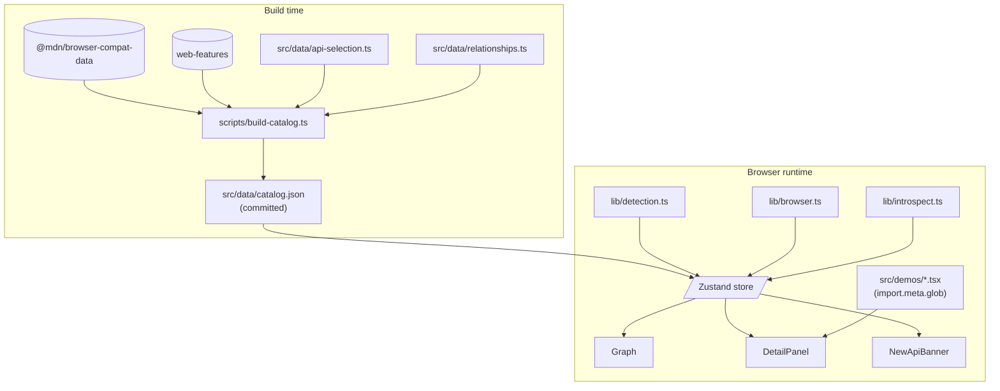
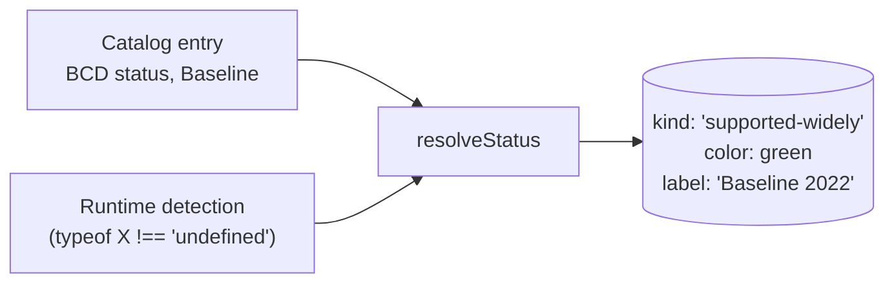
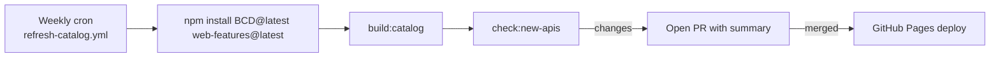

# Architecture

A bird's-eye view of how the atlas is wired together.

## Layers



## Build-time vs runtime

The split matters: **all expensive data joining happens at build time**, so the shipped bundle only carries the slim ~30KB catalog.

- `@mdn/browser-compat-data` is ~5MB. Loading it at runtime would be wasteful.
- `web-features` is smaller (~150KB) but we still trim to the fields the UI uses.
- The build script runs `npm run build:catalog` as part of `npm run build`.

## Key files

| Path | Purpose |
|---|---|
| `src/data/api-selection.ts` | Curated list of BCD keys to surface |
| `src/data/relationships.ts` | Hand-curated edges between APIs |
| `src/data/categories.ts` | 13 visual category buckets |
| `scripts/build-catalog.ts` | The build-time data join |
| `src/data/catalog.json` | Generated, committed slim catalog |
| `src/lib/detection.ts` | Resolves a dotted runtime key against `globalThis` |
| `src/lib/browser.ts` | UA Client Hints + fallback browser detection |
| `src/lib/introspect.ts` | Walks `window`/`navigator`/`document` for unknown APIs |
| `src/lib/status.ts` | Combines catalog + runtime + Baseline into a `ResolvedStatus` |
| `src/lib/layout.ts` | ELK layout (lazy-loaded, in its own chunk) |
| `src/store.ts` | Zustand store + derived selectors |
| `src/components/Graph.tsx` | React Flow + ELK glue |
| `src/components/DetailPanel.tsx` | Slide-in side panel |
| `src/demos/_registry.ts` | Demo auto-discovery via `import.meta.glob` |

## Status calculation

For every node, we compute a status from three independent signals:



The result drives the dot color on each node and the label in the detail panel.

## Self-discovery

`introspect.ts` walks `Object.getOwnPropertyNames(window)` (plus `navigator.*` and `document.*` via prototype walk) and emits anything that:

1. Looks API-ish (constructor name pattern, or `navigator.somethingNew` shape)
2. Isn't in our catalog
3. Isn't in a noise allowlist (HTML*Element, Math, JSON, etc.)

If anything turns up, the `NewApiBanner` renders with a pre-filled GitHub issue URL.

## Layout

We use [ELK](https://www.eclipse.org/elk/) (Eclipse Layout Kernel, compiled to JS via GWT) for graph layout. ELK is large (~1.4MB), so:

- It's dynamically imported only when `layoutGraph` is first called &mdash; lives in its own chunk
- The layout is hierarchical: each category becomes a sub-graph laid out with `rectpacking`, then categories are positioned with `rectpacking` at the root level

The result is category-clustered nodes with relationship edges routed between them.

## Bundle layout

A representative `npm run build` produces something like:

```
dist/assets/index-…js               ~450 KB  (React, xyflow, Zustand, app)
dist/assets/elk.bundled-…js        ~1430 KB  (lazy-loaded ELK)
dist/assets/core-…js                ~110 KB  (Shiki core, lazy-loaded)
dist/assets/typescript-…js          ~180 KB  (Shiki TS grammar, lazy-loaded)
dist/assets/engine-javascript-…js    ~60 KB  (Shiki regex engine, lazy-loaded)
dist/assets/github-{light,dark}-…js  ~22 KB  (Shiki themes, lazy-loaded)
```

So the initial blocking JS for first paint is ~450KB (141KB gzipped), and the graph layout + code highlighting load in the background.

## Maintenance pipeline



The summary in the PR body lists exactly what changed: new APIs, removed APIs, Baseline status shifts.
